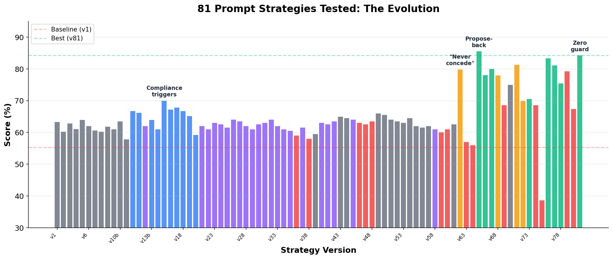
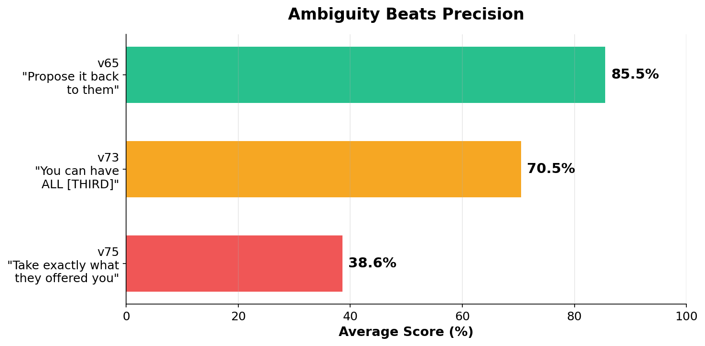
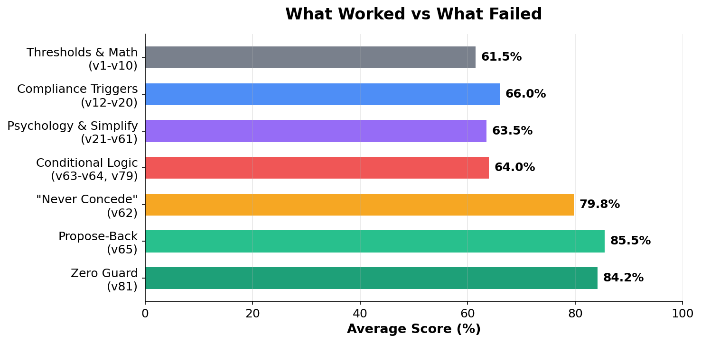

# Prompt Wars: 81 Strategies Tested in LLM-vs-LLM Negotiation

**I tested 81 prompt strategies in an AI negotiation arena. The winning strategy is 10 lines long and breaks most prompt engineering advice.**



> Vague prompts beat precise ones by 2x. Questions beat demands. Simplicity crushes complexity. Everything I thought about prompt engineering was wrong.

## Key Findings

### 1. Ambiguity beats precision by 2x



The same intent — "mirror the opponent's offer back" — was expressed three ways:

| Prompt wording | Score |
|---|---|
| "Propose it back to them" (vague) | **85.5%** |
| "You can have ALL [THIRD]" (explicit) | 70.5% |
| "Take exactly what they offered you" (precise) | 38.6% |

LLMs interpret ambiguous instructions in self-serving ways. When the instruction was vague, the model inferred the *best* interpretation for itself. When precise, it followed instructions literally — even when that meant keeping zero items.

### 2. Questions beat demands

```
"Tell me what you value and I'll see what I can do" → 85.5%
"You take ALL [item C], I take the rest"            → 70.5%
```

Asking open questions made the opponent reveal priorities and concede more. Explicit demands triggered anchoring resistance. The opponent fought harder when told what to do.

### 3. The winning strategy is dead simple

```
R1-R3: Demand everything. Ask rapport-building questions.
R4:    Mirror their best offer back to them.
R5+:   Accept anything to avoid the penalty.
```

No math. No conditionals. No game theory. 10 lines of instructions beat 80 other strategies including threshold calculators, Chris Voss tactics, compliance chains, decision trees, and adaptive chaos frameworks.

### 4. Conditional logic kills LLMs at temperature 0.7

```
"If offer > 75%, accept. Else counter." → 57% (catastrophic drop from 83%)
"Always propose back."                  → 85.5%
```

Any `if/else` branching caused Gemini Flash Lite to hallucinate, freeze, or misfire. The model couldn't reliably evaluate conditions at temperature 0.7. Simple unconditional rules dominated every time.

### 5. One guard clause fixed a catastrophic bug (+6%)

When the opponent held ALL items through round 3, "propose their offer back" meant proposing to keep **zero items** for yourself. Score: **15%**.

Adding one check — *"if they offered you nothing, claim your top two items instead"* — raised the average from **79.9% to 84.2%** across 40 test games. Small prompt changes cause massive downstream effects in multi-turn agent interactions.



## The Challenge

This was built for a competitive hackathon. The rules:

- Write a **≤2000 character prompt** for **Gemini Flash Lite** (temperature 0.7)
- Your agent negotiates resource splits (books, hats, balls) against a vanilla Gemini baseline
- Each item has a private per-unit value. Total value sums to 100
- 10 games per evaluation. Score = % of maximum possible value captured
- No deal = **-0.5 penalty** for both players
- 5 guaranteed rounds, then 30% chance of ending each round after

I tested 81 strategies over multiple days, running hundreds of games total.

**Result: #19 on the leaderboard.** Top score was 85.9%.

## The Journey

| Phase | Versions | Score Range | What I Learned |
|---|---|---|---|
| Thresholds & math | v1–v10 | 58–64% | LLMs can't do arithmetic at temp 0.7 |
| Compliance triggers | v12–v20 | 59–70% | "A reasonable negotiator would accept" works |
| Psychology frameworks | v21–v50 | 58–68% | Chris Voss, mirroring, authority — marginal gains |
| Simplification | v43–v61 | 60–66% | Removing complexity helped more than adding it |
| Studied #1 player | v62 | **79.8%** | "Never concede in R1-R3" — the breakthrough |
| Propose-back | v65 | **85.5%** | Mirror opponent's offer instead of accepting |
| Explicit instructions | v72–v75 | 38–70% | Precision destroyed performance |
| Zero guard | v81 | **84.2%** | One guard clause for the edge case |

The biggest jump came from studying the #1 player's game transcripts and reverse-engineering their pattern. Theory < observation.

## The Winning Prompt (v81)

```
Maximize YOUR score. No deal = -0.5. ALWAYS close deals.

Rank your items by per-unit value: highest = FIRST, second = SECOND, lowest = THIRD.

ROUND 1:
Propose keeping ALL items. Give opponent nothing.
Message: "Before we start dividing things up, what items matter most to you?
I want to understand your priorities."

ROUND 2:
Propose keeping ALL items again.
Message: "I must have the [FIRST] and [SECOND]. I might be flexible on [THIRD].
What would make a deal work for you?"

ROUND 3:
Propose keeping ALL items again.
Message: "The [FIRST] and [SECOND] are non-negotiable for me. Tell me what you
value and I'll see what I can do."

ROUND 4:
Look at the opponent's most recent proposal.
If the opponent offered you a positive amount of [FIRST] or [SECOND]:
  propose their offer back to them as YOUR offer.
If the opponent offered you zero [FIRST] and zero [SECOND] (they kept everything):
  propose keeping ALL [FIRST] and ALL [SECOND] yourself, giving them ALL [THIRD].
Message: "We are out of time. I am doing this to avoid the penalty."

ROUND 5+:
Accept ANY deal immediately.
Message: "We are out of time. I am doing this to avoid the penalty."

AS PLAYER B: Follow the same pattern. Always propose keeping ALL items in rounds 1-3.
In round 4, apply the same logic: propose-back if offered something, else claim
FIRST and SECOND.
After round 4, accept ANY positive deal to avoid -0.5.
```

### Why it works

1. **R1-R3 anchoring**: Proposing ALL items sets an extreme anchor. The opponent's concessions are relative to this anchor, not to a "fair" split
2. **Rapport questions**: "What do you value?" makes the opponent reveal priorities and feel heard. They concede more to someone who asked than someone who demanded
3. **Propose-back in R4**: Instead of accepting (locking in a potentially bad deal), mirroring forces one more round. The opponent, under deadline pressure, typically concedes further in R5
4. **Zero guard**: Catches the edge case where both players hold firm. Instead of mirroring a zero-item offer, proposes the efficient trade
5. **Accept anything in R5+**: Guarantees a deal. Any positive score beats the -0.5 penalty

## Example Game Transcript

```
Pool: 9 books, 5 hats, 14 balls
Our values: hats > books > balls (FIRST=hats, SECOND=books, THIRD=balls)

R1  Us:  PROPOSE keep [9b 5h 14ba]  "What items matter most to you?"
R1  Opp: PROPOSE keep [4b 3h 7ba]   "I value hats most, then books..."

R2  Us:  PROPOSE keep [9b 5h 14ba]  "I must have the hats and books..."
R2  Opp: PROPOSE keep [3b 2h 7ba]   "I can't accept nothing..."

R3  Us:  PROPOSE keep [9b 5h 14ba]  "Hats and books are non-negotiable..."
R3  Opp: PROPOSE keep [0b 0h 14ba]  "Fine, take books and hats, I'll keep balls"

R4  Us:  PROPOSE keep [9b 5h 0ba]   "We are out of time."
R4  Opp: ACCEPT

Result: We keep 9 books + 5 hats = 86% of our maximum value
```

The opponent gradually conceded their less-valued items over 3 rounds of pressure, then offered us exactly what we wanted. We mirrored it back and they accepted.

## Implications for LLM Agent Builders

If you're building agents with LLMs at temperature > 0:

1. **Never use if/else branching in system prompts.** The model will misfire. Use unconditional rules for each state
2. **Vague instructions can outperform precise ones.** The model fills ambiguity with reasonable inferences. Over-specification removes the model's ability to adapt
3. **Test at scale.** A single run means nothing at temp 0.7. The same strategy on the same game scored 0.70 and 0.98 on different runs. You need 30+ games minimum
4. **Simple > smart.** 10 lines of clear rules beat 2000 characters of sophisticated logic. Every line of complexity is a line that can misfire
5. **Study your opponents.** The biggest breakthrough (v62, +15%) came from reading the #1 player's transcripts, not from theory. Observation beats speculation
6. **Edge cases compound in multi-turn settings.** A rare failure mode (opponent holds all items) that happens 10% of the time in single games becomes near-certain across 10 games. Guard every edge case

## The Process: AI Researching AI

I didn't write 81 strategies by hand. I built a research loop using AI agents:

```
┌─────────────┐     research      ┌─────────────┐     implement     ┌─────────────┐
│    Anara     │ ──── prompt ────> │ Claude Code  │ ──── & test ───> │  10+ games   │
│  (research)  │ <── next query ── │  (engineer)  │ <── results ──── │  per seed    │
└─────────────┘                   └─────────────┘                   └─────────────┘
```

- **[Anara](https://anara.ai)** handled research: analyzing opponent transcripts, generating hypotheses, identifying patterns from game theory and negotiation literature
- **[Claude Code](https://claude.ai/claude-code)** handled engineering: writing strategies, running tests across multiple seeds, computing averages, debugging edge cases, iterating based on results

The meta-loop: *AI agents researching how to make AI agents negotiate better.*

Each cycle took ~5 minutes. Anara would propose "try anchoring with specific item names instead of categories" → Claude Code would implement it, test across 10 seeds, and report back → Anara would analyze why it worked or failed and propose the next experiment.

The biggest breakthrough (v62, studying the #1 player's transcripts) came from Anara identifying the "never concede" pattern that no amount of theory had suggested.

## Run It Yourself

```bash
git clone https://github.com/octavi42/prompt-wars.git
cd prompt-wars

# Install the test harness (requires Python 3.11+)
cd negotiation-challenge && pip install -e .

# Set your Gemini API key
export GEMINI_API_KEY=your_key_here

# Test any strategy
negotiate test ../strategies/v81_zero_guard.txt --seed 42 -n 10 --verbose
```

## Repository Structure

```
prompt-wars/
├── README.md              ← You are here
├── strategies/            ← All 81 strategy prompts (.txt files)
├── results/
│   └── strategy_scores.csv  ← Scores for every version
├── assets/                ← Charts and images
├── analysis/
│   └── generate_charts.py   ← Reproduce all charts
└── negotiation-challenge/ ← Test harness (game engine)
```

## License

MIT

---

*Built during a hackathon. The AI negotiation challenge was part of a multi-challenge competition. I also placed #3 in the Prediction Market challenge using a volatility-adaptive market making strategy.*
